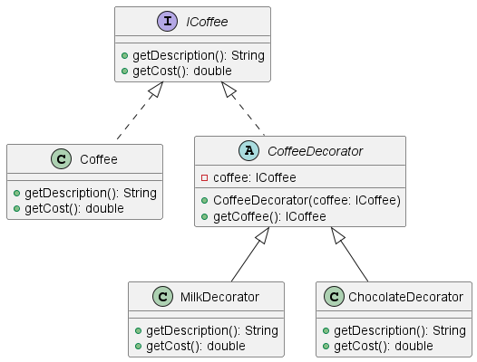

# 🧠 Understanding the Decorator Design Pattern ☕✨

In this file, we focus on the **Decorator Pattern** — great when you want to add responsibilities to objects dynamically and transparently, without changing their original code 🔧.

> **Component** = the original object interface or class  
> **Decorator** = wraps a Component to add new behavior or state

 

## 🤔 Why use the Decorator pattern?

The Decorator pattern is perfect when you want to extend an object’s behavior **at runtime** without subclassing 🌱. Common uses include:

- ☕ Adding ingredients to a coffee (milk, chocolate, sugar)  
- 🎨 Adding visual effects to UI elements  
- 🛠️ Adding logging, caching, or security features dynamically  

✅ It keeps your code flexible and avoids a big explosion of subclasses! 🧹

 

## ⚙️ How does the Decorator pattern work?

- Start with a **Component** interface or base class.  
- Create **Concrete Components** implementing the base behavior.  
- Create **Decorator** classes that wrap a Component and add new behavior before or after delegating calls.  
- Decorators can be stacked/wrapped around each other to combine behaviors dynamically.

This allows adding features transparently and flexibly without modifying existing code 🔄.  

 

## ☕ Example: Coffee with Milk, Chocolate, or Both 🍫🥛

Imagine a coffee shop where customers order coffee and can add milk, chocolate, or both.

- The **Coffee** is the **Component** with a basic cost and description.  
- **MilkDecorator** and **ChocolateDecorator** are Decorators adding their cost and description to the coffee.  
- You can wrap a Coffee with MilkDecorator, then wrap that with ChocolateDecorator to combine extras.

This way:  
- Adding new toppings is easy by creating new decorators  
- Customers can customize their coffee on the fly  
- Code stays clean and flexible without a huge number of subclasses ☕  

 

## 📊 UML Diagram

You can visualize the Decorator pattern with PlantUML:

  
