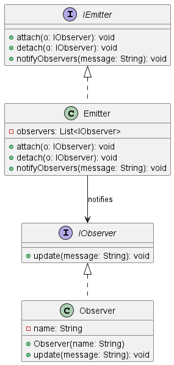

# 🧠 Understanding the Observer Design Pattern 👀

In this file, we focus on the **Observer Pattern** — great when you want one object (the **Subject**) to notify many other objects (the **Observers**) automatically when something changes ⚡️.  

> **Subject** = the main object being observed (source of changes)  
> **Observer** = objects watching the subject and reacting to changes

 

## 🤔 Why use the Observer pattern?

The Observer pattern is perfect when you want to keep different parts of your app in sync without tight coupling 🧩. Common uses include:

- 🔔 Event notifications (e.g., UI updates, alerts)  
- 📊 Data binding in UI frameworks (MVC: Model-View-Controller)  
- 📨 Publish-subscribe systems for messaging  

✅ It helps your code stay clean, flexible, and easier to maintain! 🧹

 

## ⚙️ How does the Observer pattern work?

- The **Subject** keeps a list of **Observers** (subscribers).  
- Observers can **subscribe** or **unsubscribe** from the Subject.  
- When the Subject’s state changes, it **notifies** all subscribed Observers by calling an update method.  
- Observers update themselves based on the new information.

This creates a dynamic link where many objects stay automatically updated without tight dependency 🔄.  

 

## 🏢 Example: Company and Customers 💼👥

Imagine a company that launches new products or offers special deals.  
Customers want to be notified instantly when something new happens.

- The **Company** is the **Subject** — it holds the latest news.  
- The **Customers** are the **Observers** — they subscribe to get updates.  
- When the company releases an offer, it **notifies all customers** automatically 🎉.  

This way:  
- Customers stay informed without checking manually 🕵️‍♂️  
- The company can add or remove customers easily from notifications 🔔  
- Loose coupling keeps the system flexible and scalable 🚀  

 

## 📊 UML Diagram

You can visualize the Observer pattern with PlantUML:

  

