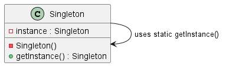

# 🧠 Understanding the Singleton Design Pattern 🔒

In this file, we focus on the **Singleton Pattern**, ideal when you need one — and only one — instance of a class throughout your application 📄.

 

## 🤔 Why use the Singleton pattern?

The Singleton pattern ensures that a class has **only one instance** throughout the entire application. This is useful when exactly one object is needed to coordinate actions across the system, such as:

- 🗂️ Managing a shared resource (e.g., database connection)  
- 🧙‍♂️ Representing unique entities (e.g., a game boss, a configuration manager)  
- 🛡️ Controlling access to global state in a safe and consistent way

✅ Using Singleton avoids bugs caused by having multiple conflicting instances and simplifies access to this unique object from anywhere in the code.

 

## ⚙️ How does the Singleton pattern work?

- The class stores a **private static variable** holding the instance.  
- When calling for a new object:
  - If the instance exists ➡️ it returns the existing one  
  - If not ➡️ it creates and stores it  
- Thus, all requests receive the **same object** 📦

 

> ⚠️ **Warning:** To prevent creation of multiple instances, **make the class constructor private**!  
> This blocks external code from instantiating the class directly and forces usage of the instance accessor method.

This ensures there's **one and only one** instance during the program’s lifecycle 🔁.

 

## 🐉 Example: DragonKing in a Game Context 👑

Imagine a game with a **unique DragonKing boss** that players must defeat.  
Having multiple bosses at once would break the game logic.

Here, the Singleton pattern guarantees there's only **one DragonKing**:
- Easy to access from anywhere  
- Impossible to create duplicates accidentally

 

## 📊 UML Diagram

You can visualize the Singleton structure with PlantUML:

