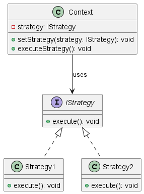

# 🧠 Understanding the Strategy Design Pattern 🎯🧩

In this file, we focus on the **Strategy Pattern** — perfect when you want to select a family of algorithms or behaviors at runtime and switch them easily 🔄.

> **Strategy** = a set of interchangeable algorithms or behaviors  
> **Context** = the object that uses a strategy to perform a task  

 

## 🤔 Why use the Strategy pattern?

The Strategy pattern helps when you want your app to choose different ways to do something without changing its structure 🏗️. 
Common uses include:

- ⚙️ Selecting different movement or attack styles in games  
- 🛠️ Switching validation rules or business logic dynamically  
- 🎮 Changing AI behaviors on the fly  

✅ It promotes flexibility, clean code, and avoids huge conditional statements! 🧹

 

## ⚙️ How does the Strategy pattern work?

- Define multiple **Strategy** classes, each implementing the same interface (same method names).  
- The **Context** holds a reference to a Strategy object.  
- The Context delegates work to the current Strategy.  
- You can change the Strategy at runtime to alter behavior without modifying the Context.

This separates the algorithm from the code using it, making your code modular and easy to extend 🔄.

 

## 🎮 Example: Game Unit Choosing Movement Mode 🚶‍♂️🏃‍♂️

Imagine a game unit that can move by either walking or running.

- Each movement style is a **Strategy** implementing a method like `move()`.  
- The **Unit** is the **Context** that holds the current movement strategy.  
- The Unit can switch between **WalkStrategy** and **RunStrategy** dynamically based on game context (e.g., stamina, terrain).

This way:  
- Adding new movement types is easy (e.g., flying, teleporting)  
- The unit’s movement behavior can change without touching its core logic  
- Code stays clean, modular, and adaptable 🚀  

 

## 📊 UML Diagram

You can visualize the Strategy pattern with PlantUML:

  
